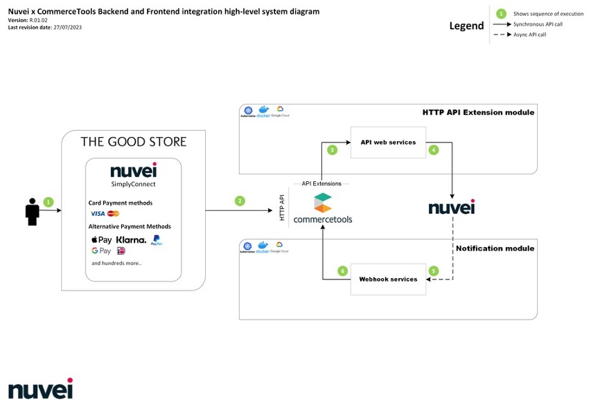
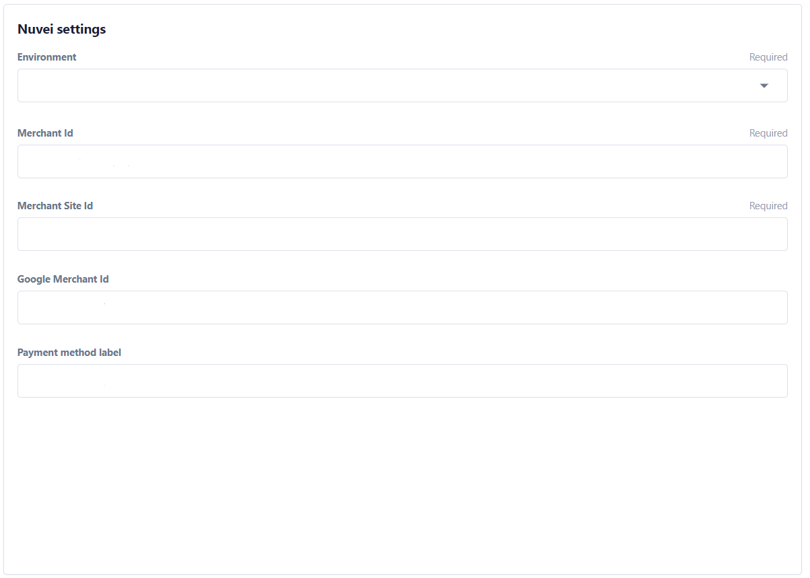
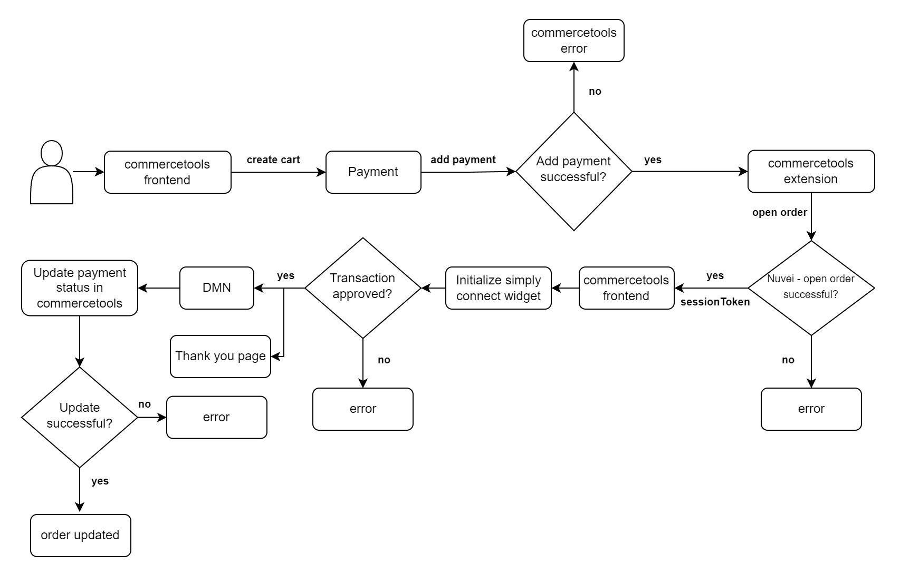

# Nuvei Commercetools Frontend Plugin - B2C Template

- [Nuvei Commercetools Frontend Plugin - B2C Template](#nuvei-commercetools-frontend-plugin---b2c-template)
- [Prerequisites](#prerequisites)
- [Important Disclaimers](#important-disclaimers)
- [Setup](#setup)
- [Studio settings](#studio-settings)
- [Payment flow](#payment-flow)
- [Back-end changes](#back-end-changes)
- [Front-end changes](#front-end-changes)

## Prerequisites

To run the plugin as part of this example repo you will need:

1. Node.js version 16.X.X (You can use [NVM](https://github.com/nvm-sh/nvm) to switch between versions) - to run this example. For your own project, use the version you support after you apply the changes.

2. Nuvei's Commercetools Composable Commerce Plugin installed and configured:

    1. Extension API - [Setup extension](https://github.com/ComposableHub/nuvei-commercetools/blob/develop/extension-api/docs/HowToRun.md)

    2. DMN API - [DMN setup](https://github.com/ComposableHub/nuvei-commercetools/blob/develop/dmn-api/docs/HowToRun.md)

## Important Disclaimers

This repository demonstrates the integration of the Nuvei payment gateway with commercetools. The code is provided as a reference and should be used as a starting point for your own implementation.

It uses the [Commercetools Frontend B2C template](https://docs.commercetools.com/frontend-development/b2c-store-launchpad-overview) as a base, specifically the latest as of 24 January 2024.

This plugin:

- Does not aim to keep up with the latest changes in the commercetools frontend template, but rather to provide a reference implementation.
- Should not be cloned and used as is in a production environment. It is recommended to use it as a reference and adapt it to your own needs by copying the relevant parts of the code and applying them to the merchant's implementation.
- Does not aim to fix any bugs or issues in the commercetools frontend template. If you encounter any issues related with the B2C Frontend Template, please refer to the [commercetools documentation](https://docs.commercetools.com/).
- Is not responsible for how order or payment totals are calculated - it simply reads the amount that is already passed to it. Verifying that the amount is correct and that you are not inheriting any bugs or issues from the current version of B2C template or any own customizations is the responsibility of the merchant.
- Does not take an opinion of the flow you should support in your store - it does not modify Order statuses or Order Payment statuses as the flow will vary by merchant. It works with Payment objects and Payment Transactions.

## Setup

Follow the [commercetools frontend setup guide](https://docs.commercetools.com/frontend-getting-started/developing-with-commercetools-frontend) to install the frontastic-cli, dependencies and start the project.

## Studio settings

See the [frontend studio](https://docs.commercetools.com/frontend-studio/accessing-the-studio) to login to to the studio. This project adds the following settings, accessible in the `Project settings` and found in [`projectConfiguration.json`](packages/poc/backend/commerce-commercetools/schemas/projectConfiguration.json):

| Name                   | Env variable               | Description                                                      |
| ---------------------- | -------------------------- | ---------------------------------------------------------------- |
| `Environment`          | NUVEI_ENV                  | The used environment. It should be either `test` or `production` |
| `Merchant Id`          | NUVEI_MERCHANT_ID          | The id of the merchant                                           |
| `Merchant Site Id`     | NUVEI_MERCHANT_SITE_ID     | The merchant site id                                             |
| `Google Merchant Id`   | NUVEI_GOOGLE_MERCHANT_ID   | The merchant id in Google                                        |
| `Payment method label` | NUVEI_PAYMENT_METHOD_LABEL | Label used on the payment method selection page. Default "Nuvei" |

## Payment flow

The following diagram illustrates the payment flow and the processes around it:

## Back-end changes

1. [NuveiController](./packages/poc/backend/commerce-commercetools/actionControllers/NuveiController.ts)

- The controller is used to create a payment in commercetools, which triggers the extension to open an order in the Nuvei system. We get back a session token, which then is used by safecharge to initialize the Nuvei Widget and proceed with the payment. The controller uses internally the cart API to process the requests.

2. [Project settings](./packages/poc/backend/commerce-commercetools/utils/GetConfig.ts)

- The `getConfig` function is extended to fetch settings specific for Nuvei, such as `nuveiEnv`, `nuveiMerchantId` etc.

    > **_NOTE:_** Schema of the project settings can be in [the project configuration JSON](packages/poc/backend/commerce-commercetools/schemas/projectConfiguration.json)

## Front-end changes

1. [NuveiWidget](./packages/poc/frontend/components/commercetools-ui/organisms/account/sections/payment-methods/nuvei/index.tsx)

- This component is responsible for rendering the modal we see after we click "Complete purchase" on the payment page. It will use combined data from the project settings (ex. env, merchantId etc.), the current payment (user details) and the sessionToken (response from NuveiController) to initialize the safecharge checkout.
    All of the data needed to initialize the widget is provided to the widget via the `NuveiContext`.

    > **_NOTE:_** In anonymous sessions, the safePM feature will be set to `false`

2. [NuveiContext](packages/poc/frontend/context/nuvei/index.tsx)

- This [React Context](https://react.dev/reference/react/createContext) is used to safe, change and provide across components all of the Nuvei-specific state, such as opening/closing the `NuveiWidget` modal, setting the session token and information around the payment. It uses a reducer function to operate on different actions and change the state accordingly.

3. [CheckoutWrapped](packages/poc/frontend/components/commercetools-ui/organisms/checkout/index.tsx)

- Used to render the `NuveiWidget`.
- Wrapped in `NuveiProvider` in order to accept state coming from the `NuveiContext`.
